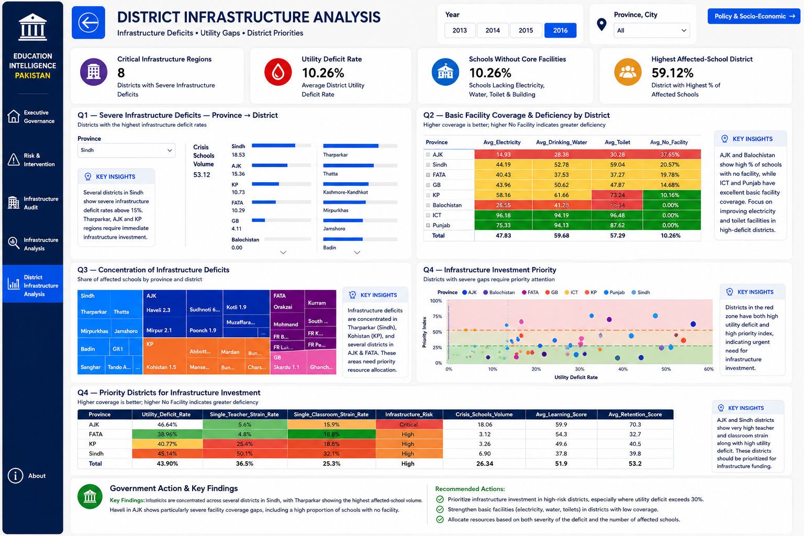
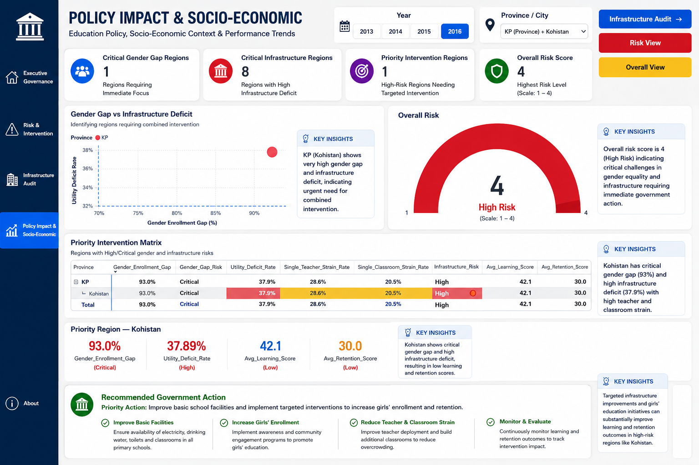

# Fixing the Gaps: Pakistan Education BI Dashboard

### A Stakeholder-Driven Power BI Dashboard for Resource Allocation and School Performance in Pakistan

## Executive Summary

This project develops a stakeholder-driven **Power BI dashboard** designed to support evidence-based education planning and resource allocation in Pakistan.

The dashboard brings together education performance, school infrastructure, enrollment, retention, learning outcomes, geographic information, and socio-economic/security context to identify regions where intervention is most needed.

The objective is to transform fragmented education data into an interactive decision-support solution that helps stakeholders understand:

* Where the largest education gaps exist
* Which regions face the greatest infrastructure and service deficits
* What factors are associated with weak education outcomes
* Which regions should receive greater attention and resources
* How education performance changes over time

---

## Business Problem

Education performance and school conditions vary considerably across regions of Pakistan. National or provincial averages can hide substantial differences between individual districts.

Decision-makers therefore need a way to move beyond simple averages and identify **specific regions where multiple challenges occur simultaneously**.

This dashboard addresses that problem by providing an interactive analytical view of:

* Education performance
* Learning outcomes
* Student retention
* Enrollment and gender disparities
* School infrastructure
* Utilities and facilities
* Staffing and classroom constraints
* Geographic differences
* Socio-economic and security context
* Trends over time

The dashboard is designed to support more targeted and evidence-based resource allocation.

---

## Project Objectives

The dashboard was developed to help education decision-makers:

* Identify regions with significant education performance gaps
* Analyze school infrastructure deficits
* Examine enrollment and gender disparities
* Evaluate learning and retention outcomes
* Identify high-risk regions requiring targeted intervention
* Compare provinces and districts
* Explore relationships between education investment and outcomes
* Support evidence-based resource allocation
* Monitor changes in education performance over time

---

## Stakeholders

The dashboard is designed with multiple education stakeholders in mind, including:

* Education policymakers
* Government education departments
* School administrators
* District education authorities
* Development organizations
* Education program managers
* Resource allocation and planning teams

Different dashboard views allow stakeholders to move from a **high-level national/provincial overview to detailed district-level analysis**.

---

# Dashboard Views

## 1. Executive Governance

Provides a high-level overview of education performance, infrastructure, enrollment, and resource conditions across regions.



---

## 2. Executive Risk & Intervention

Identifies regions experiencing critical combinations of gender, infrastructure, utility, staffing, learning, and retention risks.



---

## 3. District Infrastructure Analysis

Provides province- and district-level analysis of infrastructure conditions and identifies areas with significant facility deficits.


---

## 4. Policy Impact & Socio-Economic Analysis

Explores relationships between education investment, infrastructure, socio-economic conditions, security indicators, and education outcomes.


---

# Key Performance Indicators

The dashboard focuses on several important education indicators, including:

* Education Score
* Learning Score
* Retention Score
* Gender Enrollment Gap
* Electricity Coverage
* Drinking-Water Coverage
* Toilet Coverage
* No-Facility Rate
* Single-Teacher Strain
* Single-Classroom Strain
* Education Investment
* Regional and District Performance

These KPIs allow stakeholders to evaluate both **education outcomes and the underlying conditions that may influence them**.

---

# Key Findings

## Regional Education Performance

The analysis reveals substantial differences in education performance across regions.

| Region      | Education Score | Learning Score | Retention Score |
| ----------- | --------------: | -------------: | --------------: |
| ICT         |            81.3 |           64.6 |            81.3 |
| Sindh       |            55.9 |           41.6 |            48.8 |
| Balochistan |            51.0 |           38.3 |            43.0 |
| FATA        |            47.5 |           37.3 |            38.8 |

These differences demonstrate that education performance is highly uneven across regions. This suggests that resource allocation may be more effective when targeted according to regional need rather than distributed uniformly.

---

## Infrastructure Gaps

Across the overall dataset:

* Average electricity coverage: **47.83%**
* Average drinking-water coverage: **59.68%**
* Average toilet coverage: **57.29%**
* Overall no-facility rate: **10.26%**

District-level analysis reveals considerably larger deficits in some areas.

### Tharparkar

* **52.89%** no-facility rate
* **33.1** retention score

### Thatta

* **44.42%** no-facility rate
* **24.3** retention score

These findings highlight the importance of district-level analysis rather than relying only on national or provincial averages.

---

## High-Risk Region: Kohistan

The risk analysis identifies **Kohistan** as a particularly important intervention region.

Key indicators include:

* **93.0%** gender enrollment gap
* **37.89%** utility deficit
* **28.6%** single-teacher strain
* **20.5%** single-classroom strain
* **42.1** learning score
* **30.0** retention score

The combination of these indicators suggests that the region may require an **integrated intervention strategy** rather than a response focused on a single issue.

---

## Trends Over Time

The analysis also demonstrates why policymakers should consider trends rather than relying on a single year's performance.

For example:

* AJK's education score increased from **66.2 in 2013** to **78.1 in 2016**.
* Balochistan improved to **57.2 in 2014** before declining to **46.1 in 2016**.

These differences demonstrate that regional performance can change significantly over time and should therefore be monitored continuously.

---

# Recommendations

Based on the analysis, the project recommends:

1. **Prioritize integrated interventions** in critical regions such as Kohistan.

2. **Target infrastructure investment** toward high-deficit districts, particularly in Sindh and Balochistan.

3. **Strengthen education support** in regions with consistently weak learning and retention outcomes.

4. **Monitor regional trends over time** rather than evaluating performance using a single-year snapshot.

5. **Study successful regions**, such as AJK and ICT, to identify practices that could potentially be adapted elsewhere.

---

# Tools & Technologies

* **Microsoft Power BI**
* **Power Query**
* **DAX**
* Data Cleaning & Transformation
* Data Analysis
* Data Visualization
* Dashboard Design
* Stakeholder-Driven Analytics

---

# Repository Structure

```text
Pakistan-Education-BI-Dashboard/
│
├── PowerBI/
│   └── Pakistan_Education_Dashboard.pbix
│
├── Data/
│   └── ...
│
├── Documentation/
│   └── ...
│
├── Screenshots/
│   ├── executive-governance.png
│   ├── executive-risk-intervention.png
│   ├── infrastructure-analysis.png
│   └── policy-impact.png
│
└── README.md
```

---

# How to Use

1. Download the Power BI `.pbix` file from the `PowerBI` folder.
2. Open it using **Microsoft Power BI Desktop**.
3. Interact with the dashboard using filters, slicers, and visualizations.
4. Explore the different dashboard pages to analyze regional performance, infrastructure gaps, risks, and policy-related factors.

> Note: If the original data sources are not included or connected, some Power BI functionality may require reconnecting or refreshing the data sources.

---

# Project Status

**Completed**

This project was developed as a stakeholder-driven Business Intelligence solution focused on identifying education gaps and supporting data-informed resource allocation decisions in Pakistan.

The project demonstrates the use of **Power BI, Power Query, DAX, data analysis, visualization, and stakeholder-focused dashboard design** to transform complex education data into actionable insights.

---

## Author

**Shoaib Yousaf**

Business Intelligence & Data Analytics Project

[GitHub](https://github.com/shoaiby31)
